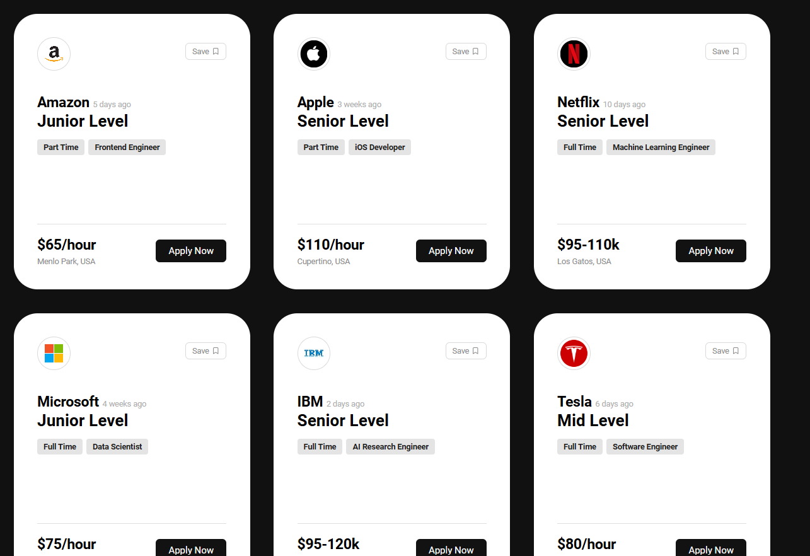

# Card React Practice 
A simple React project built while learning **components** and **props**.  
This app displays a collection of **10 job postings**, each shown as a **card** with details like job title, company, location, and salary.

## Learnings:
- Creating and reusing **React components**
- Passing and destructuring **props**
- Rendering lists using `.map()`
- Component structure: parent -> child (App -> Card)
- Passing props: e.g. <Card title="..." />
- Props drilling: pass through intermediates; use Context when needed

## 🖼️ Preview

